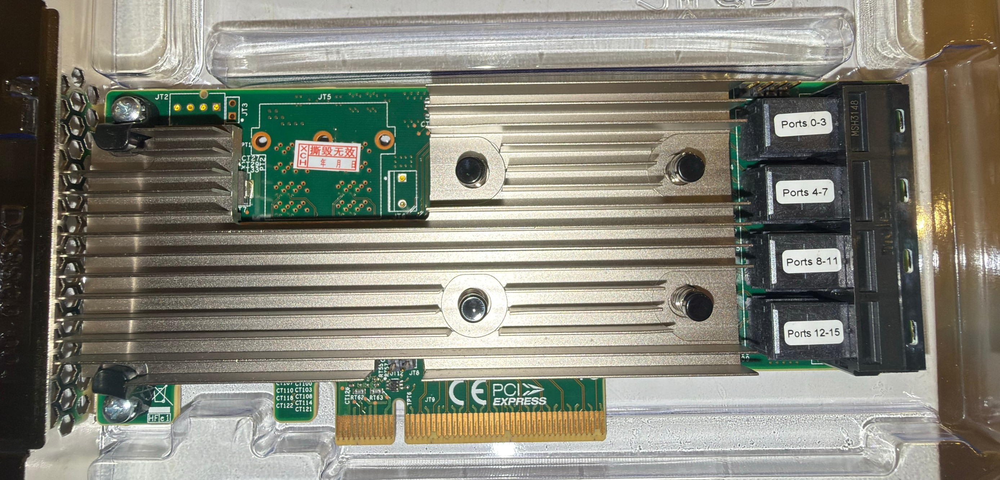
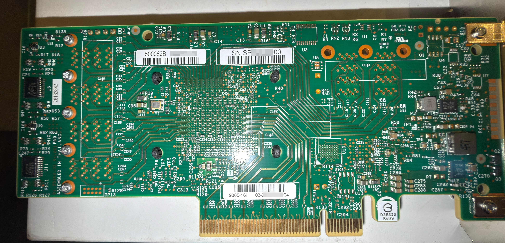

# Is my card one of these?

This project only helps one specific card: a **SAS3216** ROC on a **9305-16i-style
board with internal SFF-8643 connectors**. Before you flash anything, confirm that's
what you have. The software identity is what matters — photos vary between batches.

## What mine looks like

| Front | Back |
|---|---|
|  |  |

The tell on this batch is the **full-Chinese sticker on the front**. I haven't seen
it on any photo of a genuine 9305-16i. The eBay listing used a more legit-looking
card than what arrived — close, but not the same sticker. Treat the photos as a
"probably" signal, not proof. Confirm in software.

## The definitive check: software identity

**`lspci -nn`** — the clearest single check. You want **SAS3216** and PCI ID
**`[1000:00c9]`**:

```
01:00.0 Serial Attached SCSI controller [0107]: Broadcom / LSI SAS3216 PCI-Express Fusion-MPT SAS-3 [1000:00c9] (rev 01)
```

The device ID is the tell. It's programmed by the firmware's NVDATA, and it's the
same on the P15 and P16.12 clone firmware:

| PCI ID | Chip | Card |
|---|---|---|
| `[1000:00c9]` | SAS3216 | **this clone** |
| `[1000:00c4]` | SAS3224 | genuine 9305-16i |

Any other `1000:xxxx` is a different controller — this project doesn't apply.

**`sas3flash -list`** — the firmware's own view (board name, chip, version, SAS
address). Capture this before and after flashing so you can see the change:

```
Avago Technologies SAS3 Flash Utility
Version 17.00.00.00 (2018.04.02)
Copyright 2008-2018 Avago Technologies. All rights reserved.

    Adapter Selected is a Avago SAS: SAS3216 (A1)

    Controller Number              : 0
    Controller                     : SAS3216 (A1)
    PCI Address                    : 00:01:00:00
    SAS Address                    : 500062B-0-0000-0000
    NVDATA Version (Default)       : 10.00.00.24
    NVDATA Version (Persistent)    : 10.00.00.24
    Firmware Product ID            : 0x2228 (IT)
    Firmware Version               : 16.00.12.00
    NVDATA Vendor                  : LSI
    NVDATA Product ID              : Avago SAS3216
    BIOS Version                   : N/A
    UEFI BSD Version               : N/A
    FCODE Version                  : N/A
    Board Name                     : Avago SAS3216
    Board Assembly                 : N/A
    Board Tracer Number            : N/A

    Finished Processing Commands Successfully.
    Exiting SASSFlash.
```

Fields to check — the reliable ones:
- **Controller** — `SAS3216`
- **NVDATA Product ID** — `Avago SAS3216`
- **Firmware Product ID** — `0x2228 (IT)` (confirms IT mode, not IR/RAID)
- **Firmware Version** — `16.00.12.00` after flashing this project's image
- **NVDATA Version** — ends in `.24` on this build (that last octet is the version
  build byte the tool sets; see [analysis](analysis.md))

`BIOS Version`, `UEFI BSD Version`, and `FCODE Version` reading **N/A** is normal — we
flash firmware without an option ROM, which is the right call for an IT-mode storage
HBA. See the [flashing guide](flash-test.md) if you actually boot from the card.

Treat the **Board Name** field with care. It lives in the card's persistent
manufacturing region, and a normal flash doesn't overwrite it — the firmware's board
name only takes effect if you do a full erase (`sas3flash -o -e 7`) first. So it's
correct after a clean flash (the output above reads `Avago SAS3216`), but on a card
flashed without a full erase it can show a stale value from whatever ran before. A
full erase also wipes the SAS address, so record yours first — see the
[flashing guide](flash-test.md). For identification, lean on the erase-independent
fields — Controller, NVDATA Product ID, PCI ID.

**`dmesg`** — after flashing, the driver enumerates cleanly:

```
mpt3sas_cm0: host_add: handle(0x0001), sas_addr(0x5.....), phys(24)
mpt3sas_cm0: port enable: SUCCESS
```

`phys(24)` is expected and cosmetic — the firmware advertises 24 PHY slots from the
16i base NVDATA, but only your 16 wired PHYs enumerate.

## If your card is different

- **SAS3224** reported in `lspci` → you have a genuine 9305-16i (or 16i clone that
  already runs stock firmware). You don't need this.
- **External SFF-8644 connectors** → different PHY wiring. This image will flash but
  the ports won't enumerate. You'd need to derive your own NVDATA — the
  [analysis](analysis.md) and the build tool show how.
- **SAS3008** or anything else → wrong controller entirely; nothing here applies.

If you have a variant that isn't covered, the `sas3flash -list` output and a couple of
clear photos are exactly what a pull request would need to extend support.
